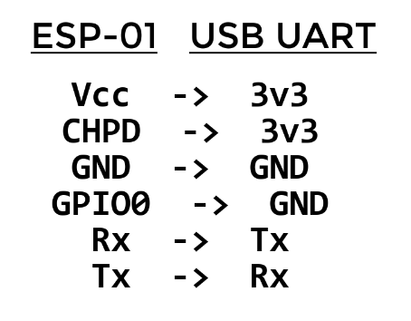

# ESP-01 sketch

The Ardunio sketch for the ESP-01.

# Need to change in sketch

- The `authentication code`, which you would have received by email from Blynk when you created the project on the Blynk app on your phone.
- The WiFi `name` and `password`.

# Need to install

- The `Blynk` library using the `Arduino library manager` in the Arduino IDE.

# How to upload code

You will need a USB UART, below are the connections you need to make to upload code to the ESP-01.

