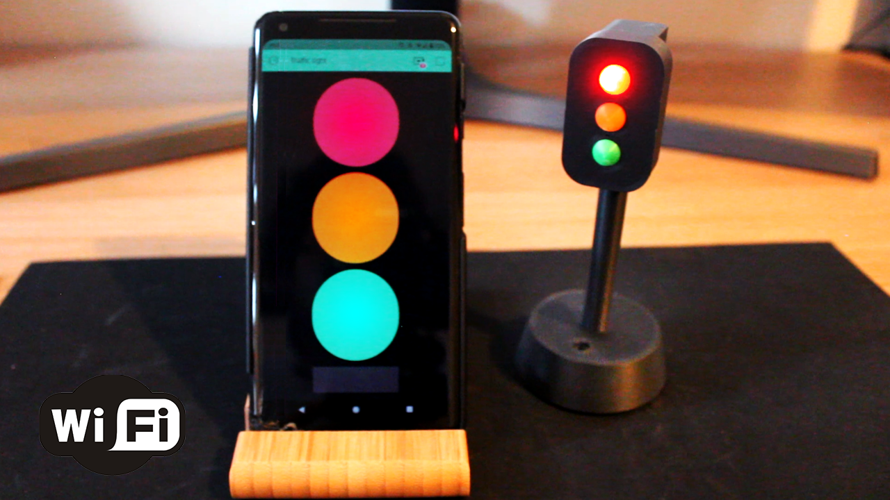
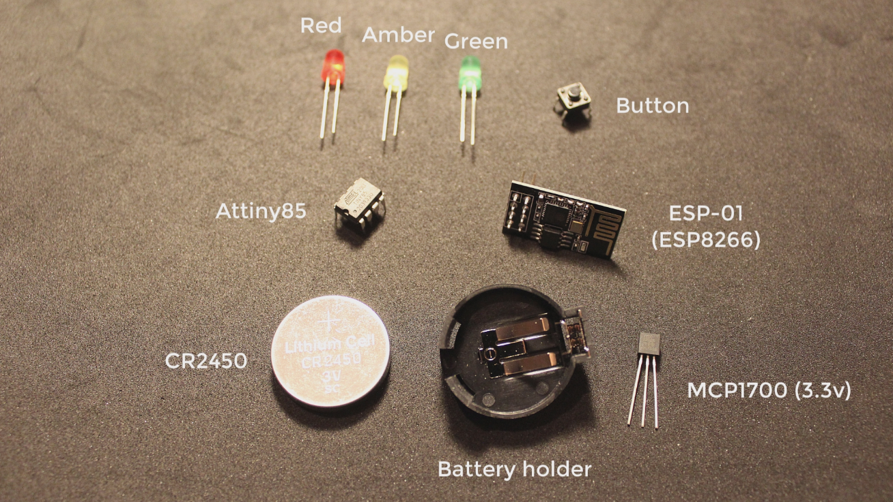
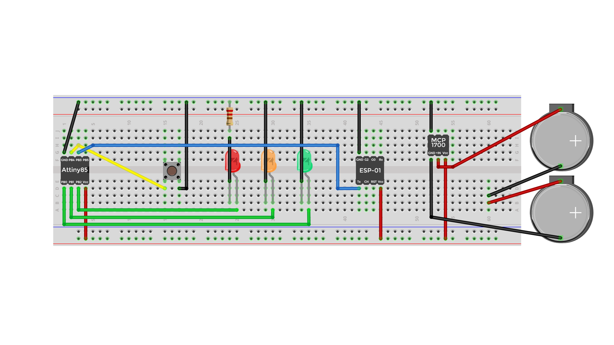

# Wireless traffic light using Attiny85 and the ESP8266 (ESP-01)

There is a [video](https://youtu.be/fJdIffIhj94) associated with this repo, I highly suggest watching it if you are going to use this repo.

# Arduino

- For the Attiny85, please refer to the `/Attiny85` directory.
- For the ESP-01, please refer to the `/ESP01` directory.

# 3D models

For all the 3D models, please refer to the `/3d_models` directory.

# Components needed

# Wiring diagram

